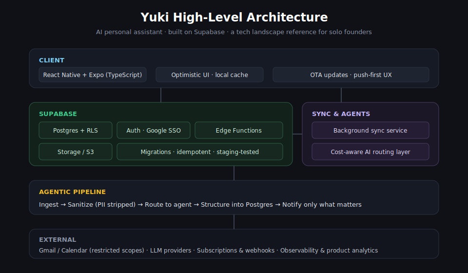
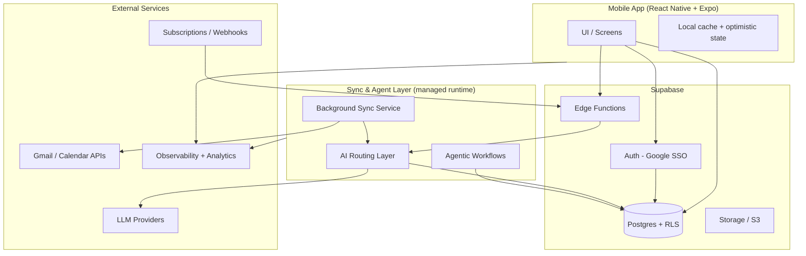

# Yuki — Architecture Overview

Yuki is an AI personal assistant that automatically organizes email, calendars, travel, expenses, subscriptions, reminders, and shared responsibilities for individuals, couples, and families — with zero manual input.

The product code is private, but this repo documents the **high-level architecture** so you can see how I structure a real, production AI product on Supabase: Postgres as the source of truth, Edge Functions for low-latency AI routing, Auth via Google SSO, and agentic background workflows.

> Built and maintained by [Sid Polisiti](https://github.com/siddharthpolisiti). Scaled to 3,000+ active users in the first two months, built solo.

**Why this exists:** when I started building Yuki I couldn't find a clear, honest reference for how a solo founder actually wires together a modern AI product without a team or a big budget. This repo is my attempt to share that tech landscape openly — the tools, tradeoffs, and structure — so other solo founders can move faster. It documents patterns, not proprietary code.

**More context:**
- Product documentation: [docs.yukihq.com](https://docs.yukihq.com)
- The stack, tooling, and cost tradeoffs I chose as a solo founder: [portfolio README](https://github.com/siddharthpolisiti/sid-portfolio)

---

## System at a glance

---

## Core principles

- **Own the data model.** Postgres is the single source of truth. Everything is relational, versioned in migrations, and protected with Row Level Security.
- **Keep the client thin.** The app renders state and captures intent. Heavy lifting (parsing, AI routing, enrichment) happens server-side.
- **Push-first, not pull-first.** The system anticipates what the user needs and surfaces it, instead of waiting to be asked.
- **Cost-aware AI.** Every model call is routed and budgeted so per-query cost stays predictable at scale.
- **Ship safely.** Clear separation between staging and production, migration discipline, and observability from day one.

---

## Data layer — Postgres + RLS

- **Postgres** holds all relational data (profiles, financial insights, trips, tasks, groups, subscriptions).
- **Row Level Security** is the primary authorization boundary. Every user-scoped table has explicit policies so a user can only ever read or write their own data.
- **Migrations** are version-controlled and idempotent. Schema changes are tested against staging before production.
- **Privacy by design:** raw email bodies are processed in-memory and are never stored — only structured, minimized output (e.g. `{ merchant, amount, date }`) is persisted.
- **GDPR-ready deletion:** account deletion runs through a single atomic RPC that cascades across all related tables, rather than risky client-side deletes.

## Auth — Google SSO

- Authentication is handled by **Supabase Auth** with Google OAuth for frictionless onboarding.
- A separate `profiles` table stores durable, app-level user data (consent timestamps, preferences) decoupled from the auth identity.
- Restricted Gmail/Calendar scopes are requested only for the features that need them.
- Because Yuki requests restricted Gmail scopes, it passed an **independent CASA Tier 2 security assessment** — covering OAuth handling, encryption, access controls, and incident response. Details: [docs.yukihq.com/security/casa](https://docs.yukihq.com/security/casa).

## Edge Functions — low-latency server logic

Supabase Edge Functions handle the work that must be fast, secure, or close to the data:

- **AI routing** — deciding which model/prompt handles a given task, with cost and latency guardrails.
- **Webhooks** — subscription and payment events processed idempotently.
- **Scheduled jobs** — batch summarization, reminders, and cleanup on cron.
- **Sensitive operations** — anything that needs the service role stays server-side, never on the client.

## Agentic workflows — the sync + intelligence layer

The "magic" of Yuki is a background layer that turns a messy inbox into structured life data:

1. **Ingest** — securely pull new signals (email, calendar) on a schedule and on app resume.
2. **Sanitize** — strip PII and reduce content before anything reaches a model.
3. **Route** — send the minimized payload through the AI routing layer to the right agent (finance, travel, tasks, delivery, etc.).
4. **Structure** — extract typed, deduplicated records and upsert them into Postgres.
5. **Notify** — surface only what matters, balancing helpfulness against notification fatigue.

Concurrency is guarded with explicit locks and mutexes so a background sync and a user-triggered refresh can never corrupt each other's state.

---

## Reliability & operations

| Concern | Approach |
|---|---|
| Environments | Separate staging and production, with staging safe to wipe |
| Deploys | JS/TS ships via OTA updates; native changes go through full builds |
| Migrations | Version-controlled, idempotent, staging-tested before prod |
| Observability | Crash reporting + tracing wired in from the start |
| Analytics | Product analytics for activation, engagement, and retention |
| Monetization | Subscriptions handled by a dedicated source-of-truth service |

---

## Stack

- **Client:** React Native, Expo, TypeScript
- **Backend:** Supabase (Postgres, Edge Functions, Auth, Storage/S3)
- **Sync & agents:** Managed runtime for background sync and agentic workflows
- **AI:** Cost-aware routing across LLM providers
- **Infra & tooling:** Google Cloud, OTA updates, crash reporting, product analytics, subscription management

---

## Why this architecture

As a solo founder, I optimized for **developer velocity, low fixed cost, and data ownership**. Supabase let me move from whiteboard to thousands of users without building and maintaining backend plumbing myself — while still keeping real Postgres, full control of my schema, and a clear path to a more complex architecture as the product grows.

If you're a solo founder figuring out your own stack, I hope this is a useful map. For the deeper tooling and cost breakdown (hosting, analytics, payments, observability, startup credits), see the [portfolio README](https://github.com/siddharthpolisiti/sid-portfolio), and for the product itself see [docs.yukihq.com](https://docs.yukihq.com).

*This document is intentionally high-level. Implementation details and product code are private.*
